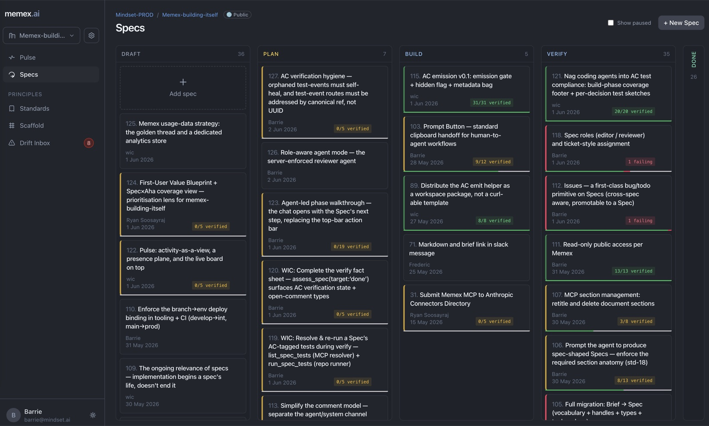

<div align="center">

# Memex

### The specification and verification layer for AI-native software teams

**Memex turns the docs your team already argues over — decisions, open questions, the tasks that fall out of them — into living *Specs* that a human and Claude edit side by side, then *verifies* the shipped code actually does what the Spec says.** Write a Spec in the web UI; let Claude Code read and update the very same Spec over MCP. One source of truth, two kinds of author — and verification, not vibes.

[](LICENSE.md)
[](https://discord.gg/fbZQACbm)
[](CONTRIBUTING.md)
[](https://www.typescriptlang.org/)

[**🌐 Website**](https://www.memex.ai) &nbsp;·&nbsp; [**🚀 Quickstart**](#-quickstart) &nbsp;·&nbsp; [**🤖 Use with Claude**](#-use-it-with-claude-mcp) &nbsp;·&nbsp; [**📖 Docs**](#-documentation) &nbsp;·&nbsp; [**💬 Discord**](https://discord.gg/fbZQACbm)



</div>

---

## What is Memex?

Software teams keep their real thinking in scattered places — a doc here, a ticket there, a decision buried in a thread. The moment code changes, all of it drifts out of date.

Memex makes that thinking a first-class, living artifact called a **Spec**: purpose, decisions, open questions, and tasks in one node that stays current. But a Spec isn't just written — it's **verified**: every Spec moves through an explicit pipeline (`draft → plan → build → verify → done`), and acceptance criteria are checked against real test runs, so "done" is a claim the system can back up. Underneath the Specs sit your **Standards** — the codified rules of how your system works — and Memex **monitors them for drift**, flagging when the code and the Standards stop agreeing. A Claude-powered agent works *inside* each Spec — in the web chat panel, and through the **Model Context Protocol (MCP)** so tools like Claude Code and Claude Desktop edit the same Spec you do.

- 🧩 **Specs, not stale docs** — decisions, tasks, and comments live together and evolve as the work does.
- ✅ **Verification, not vibes** — Specs carry acceptance criteria verified by real test runs; green means *proven*, and closing a Spec is always a human call.
- 📏 **Standards, watched for drift** — codify how your system works once; when code and Standards diverge, Memex surfaces the drift instead of letting the docs quietly rot.
- 🤝 **Human + agent, one document** — edit in the React UI or via Claude over MCP; same Spec, same source of truth.
- 🔌 **MCP-native** — `npx memex-ai` wires Claude Code & Desktop to your workspace in one command.
- 🏢 **Multi-tenant by design** — clean namespace / org / memex model with path-based routing (`memex.ai/<namespace>/<memex>`).
- ⚡ **Real-time** — every change streams over SSE to every viewer instantly.
- 🛠️ **Self-hostable & source-available** — run the whole thing yourself; read and audit every line.

> **Naming:** the user-facing nouns are **Spec** and **Standard**; under the hood the code uses generic `doc` handles (`spec-1`, `std-1`, `doc-1`).

## 🚀 Quickstart

Get a local instance running. **Prerequisites:** Node.js 22+, pnpm, PostgreSQL 16.

```bash
pnpm install                                          # 1. install deps
brew services start postgresql@16                     # 2. start Postgres
cp packages/server/.env.example packages/server/.env  # 3. add your ANTHROPIC_API_KEY
pnpm --filter @memex/server db:migrate                # 4. run migrations
make dev                                              # 5. API :8080 + React UI :5173
```

Open **http://localhost:5173**. With no auth env vars set, the server logs you in as a local dev user — zero OAuth/email setup needed to start.

Full setup (DB roles, every env var, Docker/OrbStack, seeding) lives in **[DEVELOPMENT.md](DEVELOPMENT.md)**.

## 🤖 Use it with Claude (MCP)

Point Claude Code or Claude Desktop at your Memex in one command — it opens your browser once to authorize, then writes the config for you:

```bash
# macOS / Linux
curl -fsSL https://memex.ai/install.sh | sh
# Windows (PowerShell)
irm https://memex.ai/install.ps1 | iex
```

Or run it directly with `npx -y memex-ai`. Now Claude can `list_memexes`, read and write Specs, resolve decisions, manage tasks, and `search_memex` across your workspace — see the [full tool catalogue](DEVELOPMENT.md#available-mcp-tools).

## 🏗️ How it works

```
  React UI  ──REST + SSE (JWT)──┐        ┌──Streamable HTTP (mxt_ token)──  Claude Code / Desktop
                                ▼        ▼
                    ┌─────────────────────────────────┐
                    │  Hono API  ·  Drizzle ORM        │
                    │  native auth · AI agent · MCP    │
                    └─────────────────────────────────┘
                                    │
                            PostgreSQL (Cloud SQL)
```

Hono API + Drizzle ORM, a React 19 UI, native auth (hand-rolled JWT + scrypt), and an AI agent built on the Anthropic SDK — exposing the same data to humans (REST/SSE) and to Claude (MCP). The full architecture, design decisions, and data model are in **[DEVELOPMENT.md](DEVELOPMENT.md)**.

## ⚙️ Self-hosting configuration

A deployed instance is configured through environment variables. The full list lives in **[DEVELOPMENT.md](DEVELOPMENT.md)**.

For Mindset's own deploys the per-env value (and the rest of the deploy config) is resolved by **[`scripts/deploy-config.sh`](scripts/deploy-config.sh)** from a single canonical source — a Secret Manager secret `memex-<env>-deploy-env` fetched at deploy time, so every deployer ships identical config with no per-machine drift (a local `scripts/deploy.<env>.env` stays available as an opt-in override). See **[`scripts/deploy.env.example`](scripts/deploy.env.example)** for the template; self-hosters set these however they manage their own environment.

## 📖 Documentation

| Doc | What's in it |
|---|---|
| [DEVELOPMENT.md](DEVELOPMENT.md) | Architecture, design decisions, local setup, env vars, testing, deployment |
| [CONTRIBUTING.md](CONTRIBUTING.md) | How to contribute, dev workflow, the `.ee` CLA |
| [SDD.md](SDD.md) | Spec-Driven Development — the workflow Memex is built with |
| [docs/local-mcp-client.md](docs/local-mcp-client.md) | Point an MCP client at a fully local Memex |
| [docs/connectors-claude.md](docs/connectors-claude.md) | Connecting Memex to Claude |

## 🤝 Contributing

We'd love your help. Trivial fixes can go straight to a PR (sign-off required); larger changes start with an issue so we can shape them together. Memex is itself built with the Spec-driven workflow in [SDD.md](SDD.md), so contributions are reviewed against the same Standards.

Read **[CONTRIBUTING.md](CONTRIBUTING.md)** to get started — and please follow our [Code of Conduct](CODE_OF_CONDUCT.md). PRs that touch `.ee.` files require a signed CLA (see below).

## 💬 Community & support

- 💬 **[Discord](https://discord.gg/fbZQACbm)** — questions, ideas, show-and-tell, release news
- 🐛 **[Issues](../../issues)** — bugs and feature requests
- 💡 **[Discussions](../../discussions)** — open-ended questions and proposals

## 🔒 Security

Found a vulnerability? Please **don't** open a public issue — see **[SECURITY.md](SECURITY.md)** for private disclosure instructions.

## 📄 License

Memex is **[fair-code](https://faircode.io/)** — source-available, generally free to use, and extensible by anyone, with commercial use sustainably governed by the maintainers. Concretely:

- Most of the codebase is under the **[Sustainable Use License](LICENSE.md)** — free for internal-business, non-commercial, and personal use.
- Files with **`.ee.` in the filename** or **`.ee` as a directory name** are **[Memex Enterprise License](LICENSE_EE.md)** code and require a valid Memex Enterprise license for *production* use. EE code lives in this same repo — **the file path is the license marker**, there's no private fork. Dev and testing are always free.
- Third-party components keep their original licenses; branches other than `main` are not licensed.

Enterprise licensing enquiries: **[support@mindset.ai](mailto:support@mindset.ai)**.

---

<div align="center">

Built by **[Mindset AI](https://mindset.ai)**. If Memex is useful to you, please ⭐ the repo and [join us on Discord](https://discord.gg/fbZQACbm).

</div>
